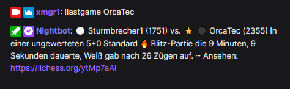

# Letzte lichess Partie anzeigen

Der Befehl zeigt das Ergebnis der letzten gespielten Partie dieses Benutzers.

## Benutzung

Einfach `!lastgame <user>` eingeben, um die Ergebnisse der zuletzt gespielten Partie anzuzeigen. Der ⭐ Stern zeigt an,
wer der Gewinner war, die schwarzen und weßen Kreise entsprechend die Figurenfarbe der Spieler.

> Die Groß-/Kleinschreibung des lichess Benutzernamens spielt keine Rolle ;)



### Letzte Partie mit einem bestimmten Gegner

Um die letze Partie von einem Spieler und einem bestimmten Gegner abzufragen, gib einfach zusätzlich zu einem
Doppelpunkt den Accountnamen des gegnerischen Spieler an, quasi `!lastgame <user1>:<user2>`.


# Einrichtung

## Einrichtung in StreamElements

Gehe zu https://streamelements.com/dashboard/bot-commands/custom-commands und füge über den "Add new command" einen
neuen Befehl hinzu.

Trage als "Command name" sowas wie `!lastgame` ein. Welchen Befehlsnamen du dafür gern nehmen möchtest, ist ganz dir
überlassen.

Bei Response muss nun folgendes eingegeben werden:

```
${urlfetch https://xmgr.io/api/lichess/lastgame?username=${1|0}}
```

Jetzt auf "Save" klicken um den Befehl zu speichern.

## Einrichtung in Nightbot

Gehe zu https://nightbot.tv/commands/custom und klicke rechts auf den Button
"+ Add Command".

Gib bei "Command" den Namen des Befehls ein, z.B. `!lastgame`.

Als Message gib folgendes ein:

```
$(urlfetch json https://xmgr.io/api/lichess/lastgame?username=$(querystring))
```

Klicke den "Submit" button um den Befehl zu speichern.

# Anpassungen

## Befehl ohne Angabe des Benutzernamens verwenden

Natürlich hast du auch die Möglichkeit, im Befehl statt der Variable direkt Deinen lichess Benutzernamen
reinzuschreiben. Somit kann man dann im Chat einfach nur `!lastgame` eingeben und man wird Dein letztes Spiel sehen.

Alternativ lässt sich das erweitern, sodass man Dein letztes Spiel mit einem bestimmten Gegner abfragen kann, indem man
den entsprechenden Part bei Nightbot in der Form `...?username=BENUTZERNAME:$(querystring)` schreibt bzw für
StreamElements mit `...?username=BENUTZERNAME:${1|0}`. Im Chat würde man dann `!lastgame ABC` eingeben und man quasi
würde die letzte Partie von "BENUTZERNAME" gegen "ABC" sehen.