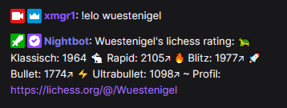
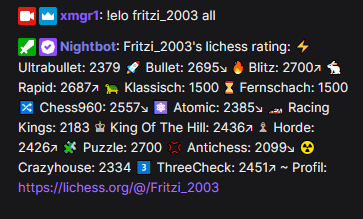
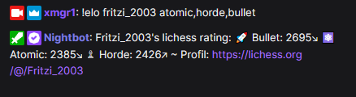

# Lichess Rating im Chat abfragen

Der Befehl holt sich für den angegebenen Benutzer die lichess Ratings und gibt sie im Chat aus.

## Benutzung

Die Nutzung des Befehls ist sehr einfach, man gibt `!elo <user>` ein, wobei `<user>` der Benutzername des lichess
Accounts ist. Statt `!elo` kannst du natürlich gern auch etwas anderes als Befehlsnamen verwenden, wie z.B. `!rating` -
das ist dir überlassen.

> Die Groß-/Kleinschreibung des lichess Benutzernamens spielt keine Rolle ;)

### Geläufige Ratings abrufen

Standardmäßig werden die Ratings für Klassisch, Rapid, Blitz, Bullet und Ultrabullet angezeigt, zum Beispiel:



### Alle Ratings anzeigen

Mit dem Befehl `!elo <user> all` lassen sich alle Ratings abrufen, das heißt auch Horde, Chess960, KingOfTheHill,
Puzzle-Rating etc..



Randinfo: statt `all` kann auch `alle` oder `*` geschrieben werden.

> Hinweis: es werden nur Ratings angezeigt, für die auch ein Wert vorliegt. Wenn
> z.B. jemand noch nie Antichess oder Chess960 gespielt hat, wird das auch nicht angezeigt - macht ja Sinn.

### Selektive Ratings anzeigen

Bei Bedarf können auch nur einzelne Ratings abgefragt werden, durch Komma getrennt auch mehrere davon, zum Beispiel
mit `!elo <user> puzzle` oder `!elo <user> atomic,horde,bullet`.



# Einrichtung

## Einrichtung in StreamElements

Gehe zu https://streamelements.com/dashboard/bot-commands/custom-commands und füge über den "Add new command" einen
neuen Befehl hinzu.

Trage als "Command name" sowas wie `!elo` oder `!rating` ein. Welchen Befehlsnamen du dafür gern nehmen möchtest, ist
ganz dir überlassen.

Bei Response muss nun folgendes eingegeben werden:

```
${urlfetch https://xmgr.io/api/lichess/rating?username=${1|${user.name}}&type=${2|0}}
```

Jetzt auf "Save" klicken um den Befehl zu speichern.

## Einrichtung im Nightbot

Gehe zu https://nightbot.tv/commands/custom und klicke rechts auf den Button
"+ Add Command".

Gib bei "Command" den Namen des Befehls ein, z.B. `!elo`.

Als Message gib folgendes ein:

```
$(urlfetch json https://xmgr.io/api/lichess/rating?username=$(querystring))
```

Klicke den "Submit" button um den Befehl zu speichern.

# Zusätzliche Funktionen (optional)

Bei Bedarf gibt es die Möglichkeit, die API URL mit zusätzlichen Argumenten aufzurufen.

> Die Beispiel-URLS sind die realen API URL Adressen, das heißt du überträgst die
> Parameter logischerweise sinngemäß in den Befehl.

> Der Benutzername wird mit `username` immer übergeben, das siehst du
> an https://xmgr.io/api/lichess/rating?username=lichess_benutzername

### Icons entfernen

Setze `icon` auf `0` um die Rating-Emojies zu entfernen.

Beispiel: https://xmgr.io/api/lichess/rating?icon=0&username=colt_tv

### Entwicklungs-Pfeile ausblenden

Um die Entwicklungs-Pfeile ↗ und ↘ nicht anzuzeigen, setze `prog` auf `0`.

Beispiel: https://xmgr.io/api/lichess/rating?prog=0&username=schachpanda_yt

### Separator zwischen Ratings

Du kannst beliebigen Text zwischen die einzelnen Ratings setzen, indem du `sep` einen Wert gibst.

Beispiel: https://xmgr.io/api/lichess/rating?sep=%20|%20&icon=0&username=orcatec

### Einleitungstext weglassen

Der Anfang mit "username's lichess Rating" kann weggelassen werden, indem `introtext` auf `0` gesetzt wird.

Beispiel: https://xmgr.io/api/lichess/rating?username=willeinhelm&introtext=0