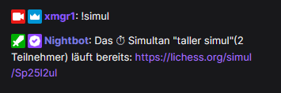

# Simultan abfragen

Der Befehl zeigt das das aktuelle Simultan.

> INFO: funktioniert (derzeit) nur für laufende Simuls.

## Benutzung

Einfach `!simul` eingeben.




# Einrichtung

## Einrichtung in StreamElements

Gehe zu https://streamelements.com/dashboard/bot-commands/custom-commands und füge über den "Add new command" einen
neuen Befehl hinzu.

Trage als "Command name" `!simul` ein. Welchen Befehlsnamen du dafür gern nehmen möchtest, ist ganz dir
überlassen.

Bei Response muss nun folgendes eingegeben werden:

```
${urlfetch https://xmgr.de/api/lichess/simul/XXXXXXXX}
```

Statt `XXXXXXXX` fügst du entsprechend deinen Lichess Benutzernamen ein.

Jetzt auf "Save" klicken um den Befehl zu speichern.

## Einrichtung in Nightbot

Gehe zu https://nightbot.tv/commands/custom und klicke rechts auf den Button
"+ Add Command".

Gib bei "Command" den Namen des Befehls ein, z.B. `!simul`.

Als Message gib folgendes ein:

```
$(urlfetch json https://xmgr.de/api/lichess/simul/XXXXXXXX)
```

Statt `XXXXXXXX` fügst du entsprechend deinen Lichess Benutzernamen ein.

Klicke den "Submit" button um den Befehl zu speichern.
