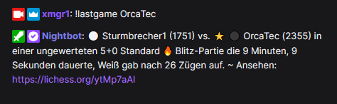
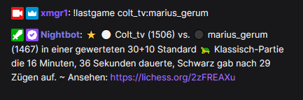

# Show last lichess game

This command shows the result and stats of the last game played on lichess.

## Usage

Just type `!lastgame <user>` to show the last game of the specified lichess user. In the output, the ⭐ indicates the
winner and the white and black circles the pieces' color.

> The upper / lower case of the lichess username does not matter;)



### Last game with a specific opponent

To show the last game of a player with a specific opponent, just add this player's name separated by a colon,
so `!lastgame <user1>:<user2>`-



# Setup

## Setup in StreamElements

Open https://streamelements.com/dashboard/bot-commands/custom-commands und hit the "Add new command" button.

For "Command name" enter something like `!lastgame`. What command name you choose doesn't matter.

Now insert the following for "Response":

```
${urlfetch https://xmgr.io/api/lichess/lastgame?username=${1|0}}
```

Now hit the "Save" to save your changes.

## Setup in Nightbot

Open https://nightbot.tv/commands/custom and click the "+ Add Command" on the right.

For "Command" type in your desired command name `!lastgame`.

Insert the following line in the "Message" input field:

```
$(urlfetch json https://xmgr.io/api/lichess/lastgame?username=$(querystring))
```

Hit the "Submit" button to save your changes.

# Additional options

## Use command without typing in the username

Alternatively you could put your literal lichess username instead of the [variables](help/variables.md). In this case,
**your** last game will be shown when writing `!lastgame` in the chat.

Additionally you can also modify the command to show **your** last game played with a specified opponent when putting a
username as argument in the chat. So for StreamElements this could be written like `...?username=USERNAME:${1|0}` or
like
`...?username=USERNAME:${1|0}` in Nightbot. Then, when a user types `!lastgame ABC` the last game between USERNAME and
ABC would be shown.
