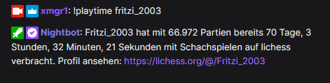

# Playtime stats

This command fetches the amount of games played on Lichess as well as the amount 
of time spent playing chess in summary.

## Usage

The usage is very simple, you type `!playtime <user>` (in which `<user>` means the Lichess username).
You can, of course, set another name for your command - just as you desire.

> The upper-/ lower case of the username doesn't matter.



# Setup

## Setup in StreamElements

Navigate to https://streamelements.com/dashboard/bot-commands/custom-commands and hit the "Add new command" button.

For "Command name" type `!playtime` (or something else).

For the "Response" please insert the following line:

```
${urlfetch https://xmgr.de/api/lichess/playtime/${1}}
```

Click the "Save" button to save your changes.

## Setup in Nightbot

Open https://nightbot.tv/commands/custom and hit the "+ Add Command" button.

For "Command" enter `!playtime` (or something else).

In the "Message" input field, insert the following line:

```
$(urlfetch json https://xmgr.de/api/lichess/playtime/$(querystring))
```

Now hit the "Submit" button to save your command.
