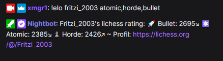

# Show Lichess Rating in Chat

This command fetches the Lichess ratings for a given user.

## Usage

The usage is quite simple, you type `!elo <user>` and that's it.

> the upper-/lower case for the Lichess username doesn't matter

### Fetch common ratings (default)

By default, the ratings for classical, rapid, blitz, bullet and ultrabullet are shown:


### Show all ratings

Via `!elo <user> all` all available ratings are shown, which includes also Horde, Chess960, KingOfTheHill,
Puzzle-Rating, Antichess etc.


Side note: you can also use `*` instead of `all`, so `!elo <user> *` then.

> Note: this will only show ratings for game types you already played at all. So if you
> never played a Chess960 game there is no Chess960 rating shown.

### Show selective ratings

If needed you can show only the stats for a single type of game, for example `!elo <user> puzzle`. You can also provide
more types separated by comma, like in `!elo <user> atomic,horde,bullet`.



# Setup

## Setup in StreamElements

Open https://streamelements.com/dashboard/bot-commands/custom-commands and hit the "Add new command" button.

For "Command name" type something like `!elo` or `!rating`.

For "Response" insert the following line:

```
${urlfetch https://xmgr.de/api/lichess/rating/${1|${user.name}}?type=${2|0}}
```

Now click "Save" to save the command.

## Setup in Nightbot

Open https://nightbot.tv/commands/custom and hit the "+ Add Command" button.

For "Command" enter `!elo`.

In the "Message" text input field, insert the following line:

```
$(urlfetch json https://xmgr.de/api/lichess/rating/$(querystring))
```

Click the "Submit" button to save your changes.
