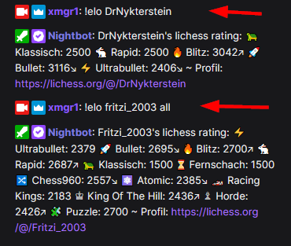
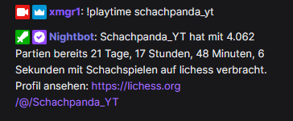
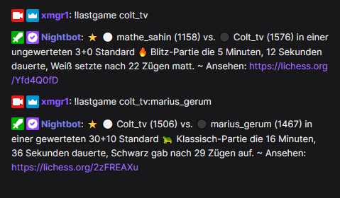
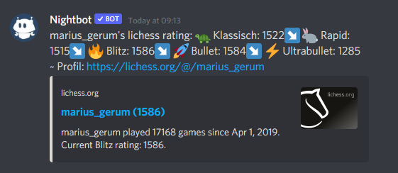

# Lichess commands for Twitch chats

A nice collection of commands you can use in Twitch or Discord to fetch lichess ratings, general stats or the last played game.

For all available commands there's a corresponding manual which describes how to easily setup
them in **StreamElements**, **StreamLabs**, **Nightbot** or **Discord**.

> Info: es gibt auch eine [deutsche Anleitung](readme.md).

## Quicklinks

If you wanna directly dive into setup manual:

- [lichess rating](en/rating.md) (`!elo <user>`)
- [Playtime stats](en/playtime.md) (`!playtime <user>`)
- [Last played game results](en/lastgame.md) (`!lastgame <user>`)

## Show lichess rating ([Manual](en/rating.md))

By entering `!elo <user>` the rating of a lichess user is shown in the chat:

## General stats ([Manual](en/playtime.md))

Just type `!playtime <user>` to see how many games that user has already played and how
much time he spent on playing games on lichess in summary.

## Fetch last game results ([Manual](en/lastgame.md))

Write `!lastgame <user>` to fetch the result of the most recently played game of the specified user.

## Show current simul

Type `!simul` to show a link to the current simul.

## General setup informations

No matter if you're using StreamElements or Nightbot for the commands, the corresponding
bot MUST definitely own Mod permissions and join the channel - that might be an obvious requirement
but just for the sake of completeness.

### Discord integration

If you're using Nightbot and Nightbot is integrated on your Discord server then
you can already use all of its commands natively on Discord as well.
To set this up, just open https://nightbot.tv/integrations and let the Nightbot join on your 
Discord server - that's it already.

## See it in action

Those nice streamers already use the commands for their Twitch or Discord:

- [Colt_TV1](https://www.twitch.tv/colt_tv1)
- [chris1996](https://www.twitch.tv/chris1996)
- [FritziSchach](https://www.twitch.tv/fritzischach)
- [Willeinhelm](https://www.twitch.tv/willeinhelm)
- [Ganzling](https://www.twitch.tv/ganzling)
- [GambitGambler](https://www.twitch.tv/gambitgambler)

## Support

Any questions or suggestions? Just lemme know, you can contact me on Discord (`xmgr#2295`) or via [Telegram](https://t.me/xmgr1).

## Credits

Thumbs-Up to [Willeinhelm](https://www.twitch.tv/willeinhelm)
and [Wuestenigel](https://www.twitch.tv/wuestenigel) who ignited the spark :)
