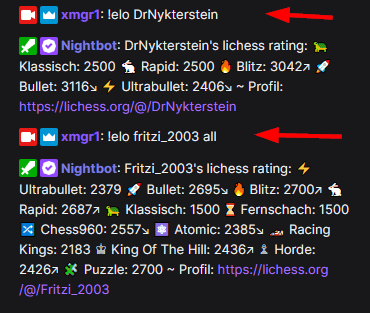
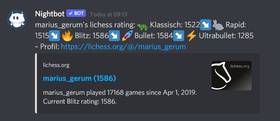

# Lichess Befehle für Twitch Chats

Eine kleine Sammlung an Befehlen um beispielsweise lichess ratings oder Spieldauer-Statistiken abzurufen, die sich
direkt im Twitch Chat nutzen lassen.

Für jede verfügbare Funktion ist hier eine Anleitung verlinkt, um die Befehle in
**StreamElements**, **StreamLabs**, **Nightbot** oder **Discord** einfach einzubinden.

> Info: there's also an [english manual](readme-en.md) available.

## Quicklinks

Um direkt zur Einrichtung zu springen:

- [lichess Rating abrufen](de/rating.md) (`!elo <user>`)
- [Spieldauer Statistik](de/playtime.md) (`!playtime <user>`)
- [Letzte Partie abrufen](de/lastgame.md) (`!lastgame <user>`)
- [Aktuelles Simul abfragen](de/simul.md) (`!simul`)

## lichess Rating abrufen ([Anleitung](de/rating.md))

Durch Eingabe von `!elo <user>` lässt sich das lichess Rating im Chat ausgeben.

## Spieldauer Statistik ([Anleitung](de/playtime.md))

Einfach `!playtime <user>` eingeben, um zu sehen wieviele Partien der lichess Benutzer bereits gespielt und wieviel Zeit
er insgesamt mit Schachspielen verbracht hat.

## Letzte Partie abrufen ([Anleitung](de/lastgame.md))

Zeigt mit `!lastgame <user>` das Ergebnis der von diesem Benutzer zuletzt gespielten Partie.

## Aktuelles Simultan abfragen ([Anleitung](de/simul.md))

Zeigt mit `!simul` das aktuelle Simultan.

## Allgemeines zur Einrichtung

Egal welchen Chatbot benutzt, in jedem Fall muss der Bot Mod-Berechtigungen haben und dem Chat
beigetreten sein - ist zwar eine ganz offensichtliche Voraussetzung, aber ich erwähne es der Vollständigkeit halber
trotzdem ;)

### Einrichtung auf Discord

Wenn du Nightbot verwendest und dein Nightbot mit deinem Discord Server verknüpft ist,
lassen sich die dort eingerichteten Befehle auch auf Discord benutzen. Rufe https://nightbot.tv/integrations auf und lasse einfach den
Nightbot per Klick auf deinen Discord Server joinen - das war's schon.

## In Aktion

Diese nicen Streamer nutzen die lichess Befehle bereits für ihr Twitch oder auf ihren Discord Servern:

- [Colt_TV1](https://www.twitch.tv/colt_tv1)
- [chris1996](https://www.twitch.tv/chris1996)
- [FritziSchach](https://www.twitch.tv/fritzischach)
- [Willeinhelm](https://www.twitch.tv/willeinhelm)
- [Ganzling](https://www.twitch.tv/ganzling)
- [GambitGambler](https://www.twitch.tv/gambitgambler)

## Support

Bei Fragen, schreib mir gerne auf Discord (`xmgr#2295`) oder [Telegram](https://t.me/xmgr1).

## Credits

Daumen-Hoch geht raus an [Willeinhelm](https://www.twitch.tv/willeinhelm)
und [Wuestenigel](https://www.twitch.tv/wuestenigel) die den Denkanstoß für diese Idee gezündet haben :)
